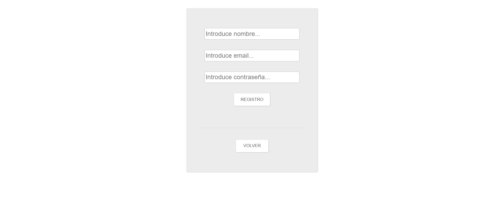

# JobOffer
Aplicación de búsqueda de ofertas de empleo por nombre del empleo y ubicación(ciudad). Permite registrarse e iniciar sesión para así poder acceder a una lista de ofertas de empleo favoritas. Además, existe el rol de administrador, el cual puede modificar los datos de usuario, crearlos y eliminarlos. Además, puede crear sus propias ofertas de empleo que aparecerán desplegadas en una lista y que tendrán prioridad ante el resto de ofertas.
<h2>Tech Stack</h2>
NodeJS, Express, Web Scrapping(Puppeteer), Heroku, MongoDB, PostgreSQL, autenticación JWT, JEST
<h2>Cómo usar</h2>
<h3>Instalación</h3>

```
 "@shelf/jest-mongodb": "^4.1.0",
    "bcrypt": "^5.0.1",
    "body-parser": "^1.20.0",
    "connect-flash": "^0.1.1",
    "cookie-parser": "^1.4.6",
    "cors": "^2.8.5",
    "dotenv": "^16.0.1",
    "express": "^4.18.1",
    "express-jwt": "^7.7.5",
    "express-pg-session": "^1.1.0",
    "express-session": "^1.17.3",
    "googleapis": "^107.0.0",
    "helmet": "^6.0.0",
    "jsonwebtoken": "^8.5.1",
    "mongoose": "^6.5.3",
    "mongoose-auto-increment": "^5.0.1",
    "morgan": "^1.10.0",
    "node-fetch": "^3.2.10",
    "nodemailer": "^6.7.8",
    "nodemon": "^2.0.19",
    "passport": "^0.6.0",
    "passport-local": "^1.0.0",
    "pdfkit": "^0.13.0",
    "pg": "^8.8.0",
    "postgre": "^0.1.8",
    "pug": "^3.0.2",
    "puppeteer": "^17.1.0",
    "sweetalert2": "^11.4.32"

```

<h3>Vistas</h3>

**<h4>Home</h4>**


En la vista Home inicial tenemos la posibilidad de iniciar sesión en caso de tener una cuenta a través de "Iniciar sesión" y de crear una nueva con "Registro". Ambas nos redireccionarán a una nueva vista con sus respectivos formularios. Más abajo tenemos un buscador de ofertas de empleo en el que podremos filtrar la búsqueda por palabra clave de empleo y ubicación. Escribiendo ambos espacios y pulsando el botón se desplegará una lista de ofertas.


En cada una de las ofertas tenemos algo de información sobre esta. Si queremos conocer más detalles, podemos pulsar spbre el título y nos dirigirá hacia el link oficial de la oferta abriendo otra pestaña del navegador. Existe también la opción de poder añadir las ofertas a favoritos pulsando en el botón que vemos en la parte inferior, pero es una opción habilitada únicamente para usuarios registrados.


Habiendo iniciado sesión se habilitará el acceso a la vista de "Favoritos" y "Mi perfil". Además, aparecerá el nombre del usuario conectado junto al botón de "Cerrar sesión", que eliminará el token creado al iniciar sesión.


En la vista del usuario administrador habrá 3 nuevos añadidos: Botón de vista "Anuncios", botón de vista "Usuarios" y botón de descarga de pdf de los anuncios creados por el administrador.

--------------------------------------------------------------------------------------------------------

**<h4>Inicio de sesión y Registro</h4>**



